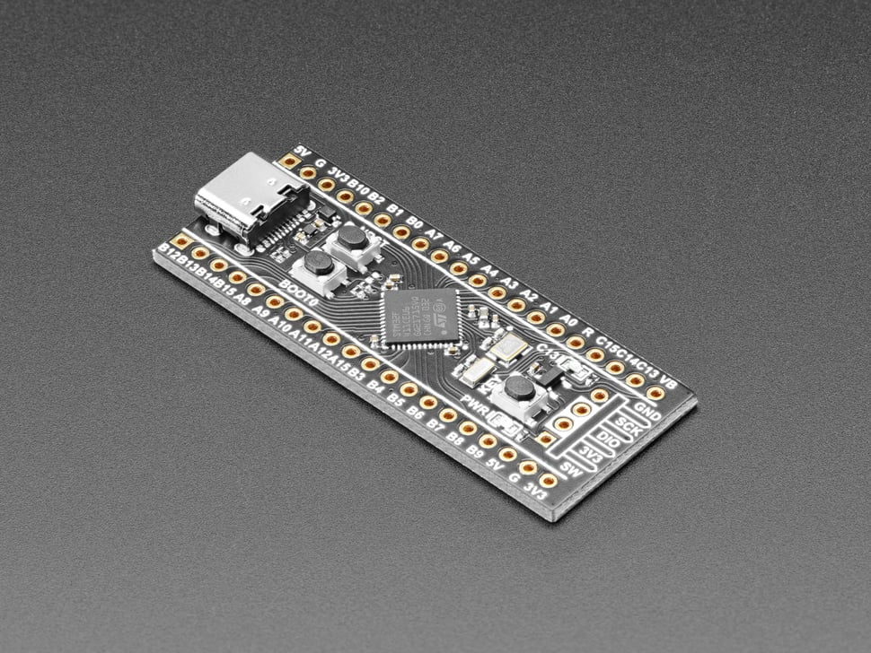

# Example -- Blackpill STM32F411

This example uses the Blackpill STM32F11 development board.


Photo from https://www.dfrobot.com

## Pinout


Photo from https://www.adafruit.com

# Building

## MSYS2

Under UCRT64, install the required packages: `git make mingw-w64-ucrt-x86_64-arm-none-eabi-toolchain mingw-w64-ucrt-x86_64-cmake`.

```
cmake --preset=debug
cmake --build build --parallel
```

# Flashing

## DFU

For Blackpill STM32F11 using the stm32 bootloader, install `dfu-util` and boot the board to dfu mode by holding `BOOT0` and pressing `NRST`.

To flash the built binary to the board:
- `dfu-util -d 0483:df11 -a 0 -s 0x08000000:leave -D build\evqueue_stm32f411.bin`

## Black Magic Probe

Using VSCode, select and run `example/stm32f411` from the launch targets. 
Might need to select the correct serial port for the bmp first.
